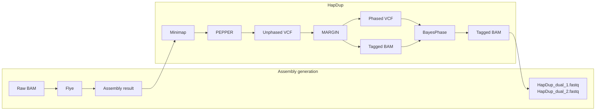

# HapDup + BayesPhase Integration

This folder contains the HapDup-based BayesPhase integration project snapshot. It preserves the HapDup project layout under `hapdup/` and adds documentation for how BayesPhase is inserted into the HapDup workflow.

The implementation is based on the original HapDup framework. BayesPhase is inserted after the PEPPER + Margin phasing stage and before HapDup's haplotype-specific polishing and structural-polishing stages. In this workflow, BayesPhase uses the phased VCF and haplotagged BAM to bridge phase blocks, then the updated haplotagged BAM is passed back into downstream HapDup steps.

## Upstream HapDup and License

This integration is derived from the original HapDup project:

- Upstream repository: https://github.com/KolmogorovLab/hapdup
- Original license: BSD-3-Clause, retained in `hapdup/LICENSE`

The HapDup framework files are included here to make the integration structure explicit. The main BayesPhase-specific HapDup pipeline change is in:

```text
HapDup_BayesPhase/hapdup/hapdup/main.py
```

Other HapDup framework files are included to preserve the original project structure and are not intended as BayesPhase method changes. Python bytecode caches (`__pycache__/*.pyc`) and Git submodule metadata files (`submodules/*/.git`) are intentionally excluded from this source snapshot.

## Figure 1. Workflow Overview



This Mermaid diagram is a repository-renderable version of the provided workflow figure.

## Integration Point

The core integration occurs after Margin generates:

- `MARGIN_PHASED.phased.vcf`
- `MARGIN_PHASED.haplotagged.bam`
- `MARGIN_PHASED.phaseset.bed`

The integrated workflow adds two additional steps before HapDup polishing:

1. Use WhatsHap to retag reads against the Margin phased VCF.
2. Run BayesPhase on the phased VCF and retagged BAM to bridge phase blocks.

The BayesPhase-adjusted BAM is then used by downstream HapDup polishing and structural polishing.

## Expected Inputs

The HapDup-BayesPhase workflow starts from the standard HapDup inputs:

```text
assembly.fasta
lr_mapping.bam
lr_mapping.bam.bai
```

The read alignments should contain methylation information required by BayesPhase. The pipeline also depends on the HapDup external tools and models:

- Flye
- minimap2 / `flye-minimap2`
- samtools / bgzip / tabix
- PEPPER model files
- Margin configuration files
- WhatsHap
- Singularity images or equivalent executable installations for PEPPER and Margin

## Expected Outputs

The final outputs remain HapDup-style diploid assembly files:

```text
hapdup_dual_1.fasta
hapdup_dual_2.fasta
hapdup_phased_1.fasta
hapdup_phased_2.fasta
phased_blocks_hp1.bed
phased_blocks_hp2.bed
```

The integrated BayesPhase stage additionally creates an intermediate bridge directory containing files such as:

```text
bridge/bridge.vcf
bridge/bridge.haplotagged.bam
bridge/bridge.log
```

## Directory Contents

```text
HapDup_BayesPhase/
  README.md
  flowchart.mmd
  SOURCE_MANIFEST.tsv
  hapdup/                       HapDup project snapshot with BayesPhase-integrated main.py
  integration_code/             Patch-style notes for the main integration point
```

Third-party HapDup submodules such as Flye, Margin, and PEPPER are referenced through `.gitmodules` and lightweight README placeholders. They should be installed from their upstream repositories when running the workflow.

## Related Files

The maintained standalone BayesPhase command-line implementation remains at the repository root:

```text
BayesPhase.py
misc.py
```

Experimental results are archived on Zenodo:

- https://zenodo.org/records/21018164
