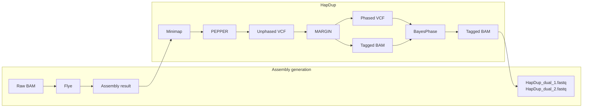

# HapDup + BayesPhase Integration

This folder documents the experimental workflow that integrates BayesPhase into the HapDup assembly pipeline.

The implementation is based on the HapDup framework. BayesPhase is inserted after the PEPPER + Margin phasing stage and before HapDup's haplotype-specific polishing and structural-polishing stages. In this workflow, BayesPhase uses the phased VCF and haplotagged BAM to bridge phase blocks, then the updated haplotagged BAM is passed back into the downstream HapDup steps.

## Figure 1. Workflow Overview



This Mermaid diagram is a repository-renderable version of the provided Figure 1 image.

## Integration Point

The core integration occurs after Margin generates:

- `MARGIN_PHASED.phased.vcf`
- `MARGIN_PHASED.haplotagged.bam`
- `MARGIN_PHASED.phaseset.bed`

The integrated workflow adds two additional steps before HapDup polishing:

1. Use WhatsHap to retag reads against the Margin phased VCF.
2. Run BayesPhase on the phased VCF and retagged BAM to bridge phase blocks.

The BayesPhase-adjusted BAM is then used by downstream HapDup polishing and structural polishing.

## Expected Inputs

The HapDup-BayesPhase workflow starts from the standard HapDup inputs:

```text
assembly.fasta
lr_mapping.bam
lr_mapping.bam.bai
```

The read alignments should contain methylation information required by BayesPhase. The pipeline also depends on the HapDup external tools and models:

- Flye
- minimap2 / `flye-minimap2`
- samtools / bgzip / tabix
- PEPPER model files
- Margin configuration files
- WhatsHap
- Singularity images or equivalent executable installations for PEPPER and Margin

## Expected Outputs

The final outputs remain HapDup-style diploid assembly files:

```text
hapdup_dual_1.fasta
hapdup_dual_2.fasta
hapdup_phased_1.fasta
hapdup_phased_2.fasta
phased_blocks_hp1.bed
phased_blocks_hp2.bed
```

The integrated BayesPhase stage additionally creates an intermediate bridge directory containing files such as:

```text
bridge/bridge.vcf
bridge/bridge.haplotagged.bam
bridge/bridge.log
```

## Directory Contents

```text
HapDup_BayesPhase/
  README.md
  flowchart.mmd
  integration_code/
    README.md
    hapdup_bayesphase_integration.patch
```

The local source snapshot used to prepare this folder was:

```text
C:/Users/luomo/Nutstore/1/我的坚果云/BayesPhase/code/HapDup_BayesPhase
```

Third-party HapDup submodules such as Flye, Margin, and PEPPER are not vendored here. They should be obtained from their upstream repositories according to HapDup's installation instructions.

## Related Files

The standalone BayesPhase command-line implementation remains at the repository root:

```text
BayesPhase_joint_phase.py
misc.py
```

Experimental results are archived on Zenodo:

- https://zenodo.org/records/21018164
